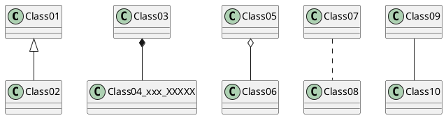

# Simple Fragment View Model Integration
The 1st version was based on chapter 32 of the book Android Studion 3.4
Essentials/Java. Here the event handler of the button click is an
anonymous object. The application/controller logic is not separated from
the UI intricacies. View Model is fine for business logic, nevertheless.

    mViewModel = ViewModelProviders.of(this).get(MainViewModel.class);  
    mViewModel = new MainViewModel(); 

When the ViewModel object is created with the normal way, rotating the
phone preserves the result text on the screen. When created with the
plain `new` operator, the result text is not preserved upon rotating the
phone. It was interesting to see that a ViewModel object can be
instantiated with the new operator.

# Using Live Data
The next version was based on chapter 33.

# Why DataBinding is not OK
In general the concept of declarative data binding is perfectly fine,
but the way it is implemented in Android is really cumbersome and of
limited scope. Here is a sample from the Android Studio 3.4 Essentials
book's chapter 35,

    <TextView
      android:text='@{safeUnbox(myViewModel.result) == 0.0 ? "Enter value" :
      String.valueOf(safeUnbox(myViewModel.result)) + " euros"}'
      ... />
    
The data binding as implemented in Android is practically usable only
for string values, otherwise it gives practically zero advantages. Only
hello-world applications are possible to implement without UI
controllers. Since we have anyway UI controller Java classes, cluttering
the layout XML with controller-like Java code is not really a clean
programming practice. Data binding with lists and recycler views are
especially complex and totally meaningless efforts; a recyler view
anyway requires an entire bunch of plumbering code including view
holders and binding function, which cannot be replaced with simple data
binding. So, while view models, live data are quite useful, data binding
is a dead end, therefore I read but skipped experimenting with chapters
34 and 35. 

# Using PlantUML to Make Architecture Diagrams
[UML Made Easy with PlantUML & VS Code](https://www.codeproject.com/Articles/1278703/UML-Made-Easy-with-PlantUML-VS-Code)
is a nice description how to configure PlantUML for VSC, and it works
great. Use Alt D on Mac to preview puml files or embedded PlantUML
scripts in md files.
[Markdown native diagrams with PlantUML](https://blog.anoff.io/2018-07-31-diagrams-with-plantuml/)
explains how to use plantuml.com proxy to display rendered image of the
diagram script. 
For example this block is displayed in VSC.

[Markdown Navigator](https://vladsch.com/product/markdown-navigator)
plugin for Android Studio is advertised to support PlantUML: "PlantUML
rendering of fenced code languages puml and plantuml", and has
[documentation](https://github.com/vsch/idea-multimarkdown/wiki) 
but not specific on how to configure the navigator to
render PlantUML.

In the meantime I have installed Graphviz via `brew install graphviz` on
my Mac Book for the
[PlantUML plugin for Android Studio](https://plugins.jetbrains.com/plugin/7017-plantuml-integration),
so I could make puml or plantuml files and visualize them within AS.

In order to get rendered images on GitHub, diagrams are to be written in
separate puml files and not embedded in md documents. 

# Data Binding Might Still Be Interesting
After I learned the first article
[No More findViewById](https://medium.com/androiddevelopers/no-more-findviewbyid-457457644885)
from [George Mount's series about data binding](https://medium.com/@georgemount007) , I changed my mind, and I
am open to learn more about data binding, and I'll decide later.

