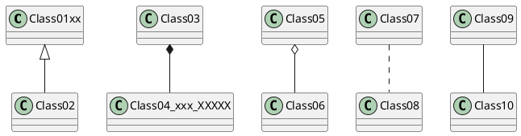
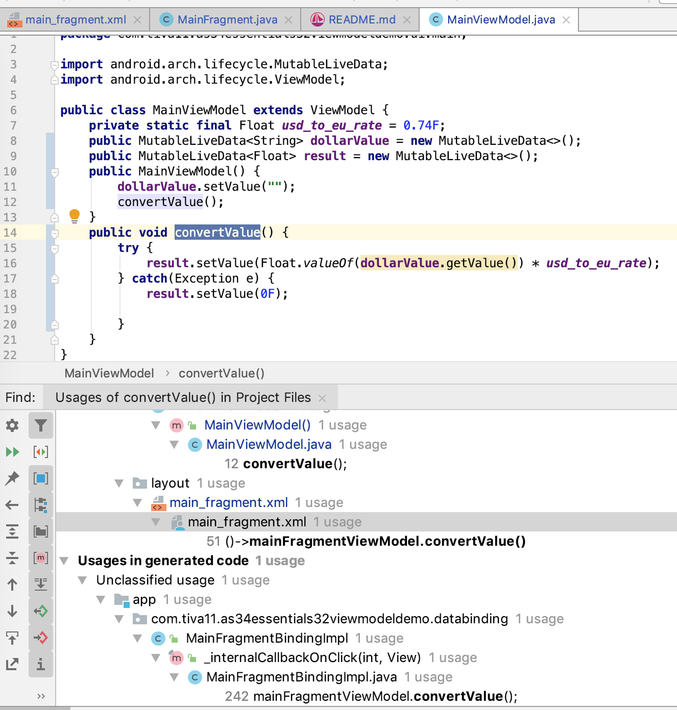

# Simple Fragment View Model Integration
The 1st version was based on chapter 32 of the book Android Studion 3.4
Essentials/Java. Here the event handler of the button click is an
anonymous object. The application/controller logic is not separated from
the UI intricacies. View Model is fine for business logic, nevertheless.

    mViewModel = ViewModelProviders.of(this).get(MainViewModel.class);  
    mViewModel = new MainViewModel(); 

When the ViewModel object is created with the normal way, rotating the
phone preserves the result text on the screen. When created with the
plain `new` operator, the result text is not preserved upon rotating the
phone. It was interesting to see that a ViewModel object can be
instantiated with the new operator.

# Using Live Data
The next version was based on chapter 33.

# Why DataBinding is not OK
In general the concept of declarative data binding is perfectly fine,
but the way it is implemented in Android is really cumbersome and of
limited scope. Here is a sample from the Android Studio 3.4 Essentials
book's chapter 35,

    <TextView
      android:text='@{safeUnbox(myViewModel.result) == 0.0 ? "Enter value" :
      String.valueOf(safeUnbox(myViewModel.result)) + " euros"}'
      ... />
    
The data binding as implemented in Android is practically usable only
for string values, otherwise it gives practically zero advantages. Only
hello-world applications are possible to implement without UI
controllers. Since we have anyway UI controller Java classes, cluttering
the layout XML with controller-like Java code is not really a clean
programming practice. Data binding with lists and recycler views are
especially complex and totally meaningless efforts; a recyler view
anyway requires an entire bunch of plumbering code including view
holders and binding function, which cannot be replaced with simple data
binding. So, while view models, live data are quite useful, data binding
is a dead end, therefore I read but skipped experimenting with chapters
34 and 35. 

# Using PlantUML to Make Architecture Diagrams
[UML Made Easy with PlantUML & VS Code](https://www.codeproject.com/Articles/1278703/UML-Made-Easy-with-PlantUML-VS-Code)
is a nice description how to configure PlantUML for VSC, and it works
great. Use Alt D on Mac to preview puml files or embedded PlantUML
scripts in md files.
[Markdown native diagrams with PlantUML](https://blog.anoff.io/2018-07-31-diagrams-with-plantuml/)
explains how to use plantuml.com proxy to display rendered image of the
diagram script. 
For example this block is displayed in VSC.

[Markdown Navigator](https://vladsch.com/product/markdown-navigator)
plugin for Android Studio is advertised to support PlantUML: "PlantUML
rendering of fenced code languages puml and plantuml", and has
[documentation](https://github.com/vsch/idea-multimarkdown/wiki) 
but not specific on how to configure the navigator to
render PlantUML.

In the meantime I have installed Graphviz via `brew install graphviz` on
my Mac Book for the
[PlantUML plugin for Android Studio](https://plugins.jetbrains.com/plugin/7017-plantuml-integration),
so I could make puml or plantuml files and visualize them within AS.

In order to get rendered images on GitHub, diagrams are to be written in
separate puml files and not embedded in md documents. 

It was very important to add `cache=no` to the link. And the brilliant
with this solution, thanks to anoff, that it works right away with
Markdown Navigator, too, in AS.

# Data Binding Might Still Be Interesting
After I read the first article
[No More findViewById](https://medium.com/androiddevelopers/no-more-findviewbyid-457457644885)
from
[George Mount's 2016-17 series about data binding](https://medium.com/@georgemount007)
, I changed my mind, and I am open to learn more about data binding, and
I'll decide later. So, I have implemented the first step, I enabled data
binding and eliminated all findViewById calls and variables. Instead, I
used the generated fragment binding class to access the fields. The nice
thing with the generated class is that it is typed, no need for type
casting findViewById any more.

# Variables and Binding Expressions in Layout XML
This iteration is based on chapters 34 and 35 of Android 3.5 Essentials.

The main features of Data Binding are:
- No need for findViewById, even without binding expressions
- Direct and immediate data transfer between live data fields and edit
  text views
- Declarative data linking: binding expressions in layout XML via data
  variables
- Button, menu action triggering via listeners

Steps to work with data binding:
- Enable data binding in gridle.module
- Enclose all XML with `<layout>` tag
- Load layout XML with special data binding functions
- Add `<data>` tags and variables to XML for binding expressions
  (optional)
  
Integer identifiers are generated for the variables defined in data
sections of the layout XML in BR similar to R. BR standing for Binding
Resource ID. Chapter 34 suggests to use ~~setVariable~~ of the binding
class, but this is a shockingly bad suggestion, absolutely unsafe, and
the programmer could mess up things, since the compiler doesn't check,
if the actual value object used in the
~~XxxBinding.setVariable(BR.variableName, valueObject)~~ and you will have a
flashy exception in logcat and the app crashes:

    2019-06-24 17:33:13.889 15068-15068/? E/AndroidRuntime: FATAL EXCEPTION: main
    Process: com.tiva11.as34essentials32viewmodeldemo, PID: 15068
    java.lang.ClassCastException: com.tiva11.as34essentials32viewmodeldemo.ui.main.MainFragment cannot be cast to com.tiva11.as34essentials32viewmodeldemo.ui.main.MainViewModel
        at com.tiva11.as34essentials32viewmodeldemo.databinding.MainFragmentBindingImpl.setVariable(MainFragmentBindingImpl.java:67)
        at com.tiva11.as34essentials32viewmodeldemo.ui.main.MainFragment.onActivityCreat

Fortunately, Google designers are smarter than chapter 34/35, and the
generator generates typesafe setters for each variables defined in the
data sections. So, you'd never have to use BR identifiers, and you
shouldn't.

The numeric BR identifiers are sometimes generated only when the project
is made/built. Sometimes it's not enough just to edit the XML, the
project should be rebuilt to force Android Studio to generate the BR
fields for the XML variables. In a number of cases, the binding class is
regenerated right away.even show in the design view.

The onClick handler definition for the button is a lambda expression
`android:onClick="@{()->mainFragmentViewModel.convertValue()}"` If you
make a mistake you will have a compilation error when building the
project.

These binding expressions can only be edited in text mode, they are not
even show in design view.

The good thing is that the Find Usages function will list all layouts
that references the funtions or LiveData/ViewModel variables, absolutely
brilliant: 

On the other hand `refactor` and renaming didn't change the references in
the XML files.

String resources can be referenced with the usual syntax
`android:text="@{@string/euros + &quot;: &quot; +
mainFragmentViewModel.euroFloatValue}"` For embedded double quotation
marks in the XML, you can use the regular &amp;quot; XML syntax; or, the
entire value can be enclosed in single quotes, like so
`android:text='@{@string/euros + ":" +
mainFragmentViewModel.euroFloatValue}'`

# Run Time Exceptions in Java
When an exception is derived from RunTimeException, the Java compiler
doesn't enforce to catch it or mark as throws. NumberFormatException is
a subclass of IllegalArgumentException derived from RunTimeException.
NullPointerException is derived from RunTimeexception, too. These are
the exceptions Float.valueOf can throw.

